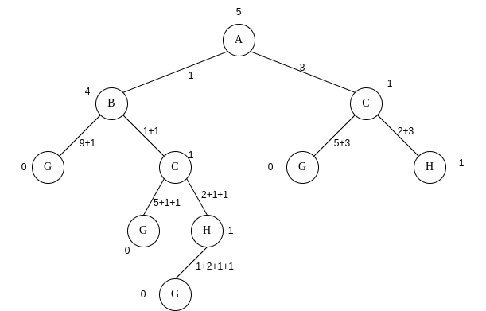

# Agents Entrega 1

### Por Victor Vergara

#### Ex1)

##### a)

###### 2) A -> B -> C -> H -> G

###### 3) Sim, porque o custo real é maior ou igual que o custo da eurística, assim sendo admissível.

###### 4) Sim, o algoritmo é ótimo, pois chega na resolução correta, mas no causo da heurística ser 0 o algoritmo A* funciona igual ao algoritmo de custo uniforme

###### 5) Não, porque se o custo é 0 para todos o A* abre os nodos de maneira aleatória.

##### b) A principal diferença entre os algoritmos Subida da Montanha e os demais algoritmos que utilizam heurística é o fato do Subida de Montanha criar uma nova árvore para os sucessores, assim não utilizando memória nem tendo o caminho que fez para chegar no resultado.

##### c) Seria necessário ter uma tabela ou grafo das cidades com suas latitudes e longitudes, assim seria possível calcular a distância linear entre as cidades e utilizar esse valor para a heurística, assim ocupando menos memória.

